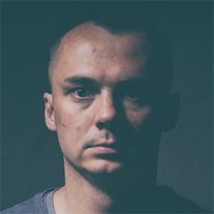

## About

I'm Radek Molenda - a father of two and a housband of one. I'm a former rock guitar player, being now a bass player and singer in a band that doesn't have name yet. I'm passionate about Photography.

I work as a Ruby developer in [Leadformance](http://www.leadformance.com/en/). Huge fan of functional programming, currently learing Elixir...

I'm an author of:

  *  [yaml-tomato](https://github.com/RadekMolenda/yaml-tomato)

and I contributed to:

  * [id](https://github.com/onthebeach/id)
  * [gemonames](https://github.com/Leadformance/gemonames)
